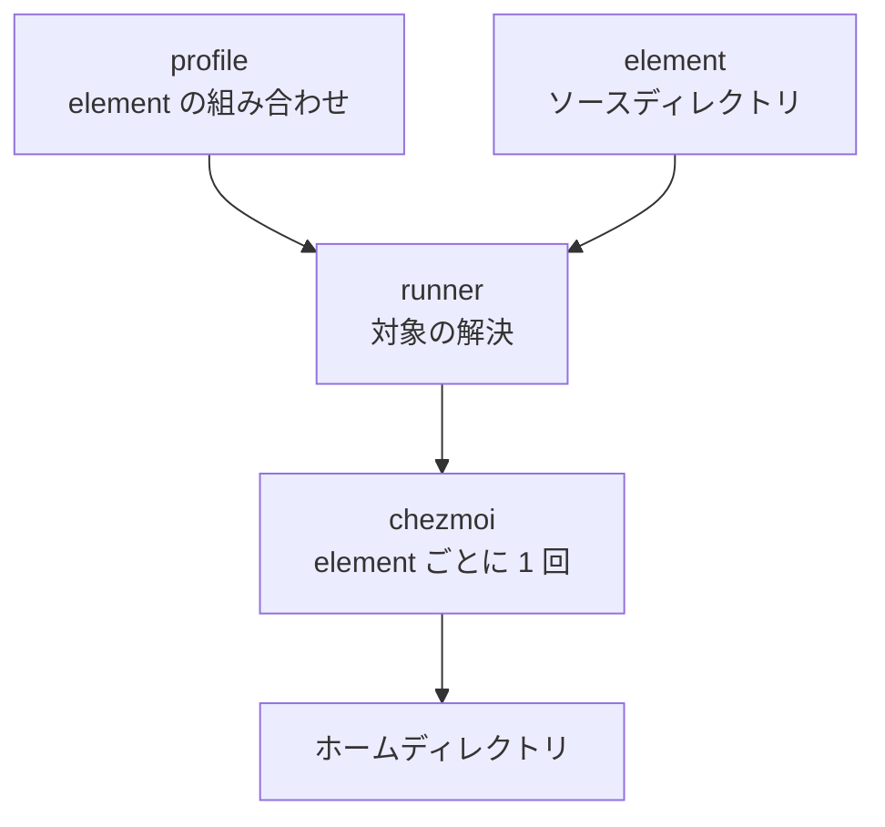
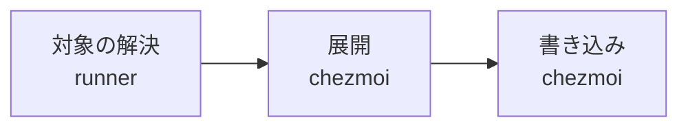

# 構造

本ドキュメントは、chezmoi 層の層構造、element ごとにソースディレクトリを分ける理由、および適用の段階を扱う。

## 層

profile と element からホームディレクトリまでは 3 層からなる。



各層の役割は次のとおりである。

- element は profile が個別に選択する管理の 1 単位であり、chezmoi のソースディレクトリを 1 つ持つ
- profile は element の組み合わせに名前を付けたものであり、1 つの環境に対応する。適用する element の選択は profile のみで行う
- runner は、profile から対象の element を解決し、そのソースディレクトリを指定して chezmoi を呼び出す

ホームディレクトリのファイルを書き換えるのは chezmoi である。runner は書き換えを行わない。

## ディレクトリ構成

chezmoi 層の構成を、以下に示す。

```text
chezmoi/
├── run_chezmoi.ps1               エントリポイント (Windows)
├── run_chezmoi.sh                エントリポイント (WSL2)
├── init.ps1                      profile を対話的に選ぶ入口 (Windows)
├── apply.ps1                     適用の対象を対話的に選ぶ入口 (Windows)
├── chezmoi.toml                  chezmoi へ渡す設定
├── docs/
├── elements/
│   └── <element 名>/
│       ├── element.json          element の宣言
│       └── home/                 ソースディレクトリ
└── profiles/
    └── <profile 名>.json         profile の宣言
```

`chezmoi.toml` は `modify_` スクリプトの実行方法のみを定める。ソースディレクトリと状態ファイルの位置は element ごと、環境ごとに変わるため、設定ファイルには持たせず runner が呼び出しのたびに指定する。

## runner の二重化

runner は Windows 用と WSL2 用の 2 つを持つ。profile が Windows の環境と WSL2 の環境の双方を表すためである。

2 つは対象の解決の規則を共有し、element と profile の宣言も共有する。実装を分けるのは、Windows PowerShell 5.1 と bash のいずれもが、他方の実行環境を前提にできないためである。

element の適用先の OS は element 自身が判定しない。判定は profile が行い、その OS で意味を持つ element のみを選ぶ。element の内容に OS ごとの分岐を持ち込まないためである。

## element ごとのソースディレクトリ

chezmoi のソースディレクトリは、適用先のディレクトリ構造をミラーする。ソース側のファイル名とその位置が target のパスを定めるためである。

1 つのソースディレクトリで複数の element を扱うと、element の内容は適用先の構造に従って散らばる。WezTerm の設定は `private_dot_config/wezterm/` へ、VS Code の設定は `AppData/Roaming/Code/User/` へ置かれ、element ごとにまとまらない。この構成で element ごとに内容をまとめるには、実体を `.chezmoitemplates/` へ置き、target に対応するパスへは実体を参照する 1 行のみを置く必要がある。element 1 件の内容が 2 か所へ分かれる。

element ごとにソースディレクトリを分けると、ミラーする構造は element の内部に収まる。内容は target に対応するパスへ直接置き、参照のための記述を要さない。

この構成では、chezmoi の 1 回の呼び出しで扱えるのは element 1 件である。element の全体を対象とする適用は、element の件数だけ chezmoi を呼び出すことで行う。この繰り返しは runner が担う。

## chezmoi の機能との対応

要件と、それを実現する機能の対応を、以下にまとめる。

| 要件 | 実現する機能 | 記述の位置 |
| --- | --- | --- |
| element ごとに内容と適用の単位を分ける | ソースディレクトリの分離 | `elements/<element 名>/home/` |
| profile が選ばない element を適用しない | 対象の解決 | runner |
| 適用先の既存の内容へ一部のみを統合する | `modify_` スクリプト | ソースディレクトリ内の target に対応するパス |
| スクリプトへ埋め込む内容を target としない | `.chezmoitemplates` | ソースディレクトリ内の `.chezmoitemplates/` |
| リポジトリの外にある内容を配置する | external | ソースディレクトリ内の `.chezmoiexternal.toml` |
| 適用の後にコマンドを実行する | `run_onchange_after_` スクリプト | ソースディレクトリ直下 |

ソースディレクトリの直下に置いたファイルは、いずれも target となる。target としない内容を持つのは `.chezmoitemplates` などの chezmoi が定める名前のディレクトリに限られる。vscode が `.chezmoitemplates/settings.json` を持つのは、統合スクリプトへ埋め込む内容を JSON のまま保つためである。

ソース側のファイル名に付く接頭辞と接尾辞の意味を、以下にまとめる。

| 記法 | 意味 |
| --- | --- |
| `dot_` 接頭辞 | 適用先のパスでは `.` に置換される。`private_dot_config` は `~/.config` を指す |
| `private_` 接頭辞 | 適用時に所有者以外の権限を落とす。Windows では無視される |
| `executable_` 接頭辞 | 適用時に実行権限を与える。Windows では無視される |
| `.tmpl` 接尾辞 | テンプレートとして展開してから書き込む |
| `modify_` 接頭辞 | 適用先の現在の内容を標準入力で受け取り、標準出力を新しい内容とするスクリプトとして扱う |
| `run_onchange_` 接頭辞 | 内容が変わったときに限り実行するスクリプトとして扱う。target を持たない |

## 適用の段階

適用は、後段が前段の出力のみに依存する 3 段階からなる。この順に説明する。



- 対象の解決は、確定した profile と指定された element 名から、対象の element を profile の記述順に並べる
- 展開は、element 1 件のソースディレクトリを読み、テンプレートを評価し、external を取得する
- 書き込みは、展開の結果をホームディレクトリへ反映する。`modify_` スクリプトを持つ target では、スクリプトの標準出力を反映する

## element の独立性

element どうしの独立は、次の 3 つで保つ。

- 内容はソースディレクトリに閉じる。element をまたぐ参照を持たない
- target は element どうしで重ならない。重なった場合、後に適用した element の内容が残る
- 適用の対象は element 単位で指定できる。element 1 件を指定した適用では、chezmoi が他の element のソースディレクトリを読まない

element が他の element の動作を前提とする場合は、参照ではなくディレクトリを介する。対話シェルの初期化がこれに当たり、加える側は `~/.config/bash/rc.d/` 配下の自身の target を置くのみである。経路は、[bash の設定](../elements/bash.md) を参照。

## 他のソースディレクトリからの独立

chezmoi は、既定では状態ファイルを 1 つ持つ。既定の位置をそのまま用いると、別のソースディレクトリを扱う chezmoi と状態を共有することになる。

これを避けるため、状態ファイルの位置を環境ごとの専用のディレクトリへ移す。位置の指定は runner が呼び出しのたびに行う。状態ファイルは element ごとには分けない。記録の単位が target のパスであり、element どうしで重ならないためである。

## 文字符号化と改行コード

Windows PowerShell 5.1 は、BOM を伴わない `.ps1` をシステムのコードページとして読む。非 ASCII 文字を含むスクリプトは、この読み方では解析に失敗しうる。このため、`modify_` スクリプトを適用先へ書き出す際は BOM を伴う UTF-8 とする。

`modify_` スクリプト自身は、標準入力と標準出力を UTF-8 のストリームとして開き直す。Console の既定の符号化はシステムのコードページであり、適用先の非 ASCII 文字を保てないためである。この扱いを要するのは Windows のスクリプトに限る。

リポジトリの作業ツリーの改行コードは `.gitattributes` により LF に固定する。chezmoi はソースの内容をそのまま書き込むため、適用後のファイルも LF となる。
